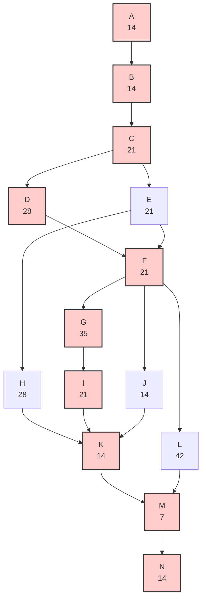

```mermaid
graph TD
    A["A<br>14"] --> B["B<br>14"]
    B --> C["C<br>21"]
    C --> D["D<br>28"]
    C --> E["E<br>21"]
    D --> F["F<br>21"]
    E --> F
    E --> H["H<br>28"]
    F --> G["G<br>35"]
    F --> J["J<br>14"]
    F --> L["L<br>42"]
    G --> I["I<br>21"]
    H --> K["K<br>14"]
    I --> K
    J --> K
    K --> M["M<br>7"]
    L --> M
    M --> N["N<br>14"]

    style A fill:#ffcccc,stroke:#333,stroke-width:2px
    style B fill:#ffcccc,stroke:#333,stroke-width:2px
    style C fill:#ffcccc,stroke:#333,stroke-width:2px
    style D fill:#ffcccc,stroke:#333,stroke-width:2px
    style F fill:#ffcccc,stroke:#333,stroke-width:2px
    style G fill:#ffcccc,stroke:#333,stroke-width:2px
    style I fill:#ffcccc,stroke:#333,stroke-width:2px
    style K fill:#ffcccc,stroke:#333,stroke-width:2px
    style M fill:#ffcccc,stroke:#333,stroke-width:2px
    style N fill:#ffcccc,stroke:#333,stroke-width:2px
```
