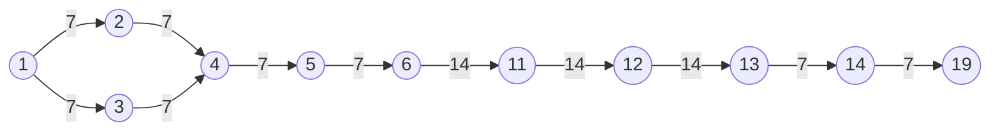

```mermaid
graph LR
    A((1)) -->|7| B((2))
    A -->|7| C((3))

    B -->|7| D((4))
    C -->|7| D

    D -->|7| E((5))
    E -->|7| F((6))

    F -->|14| G((11))
    G -->|14| H((12))
    H -->|14| I((13))
    I -->|7| J((14))
    J -->|7| K((19))
```
